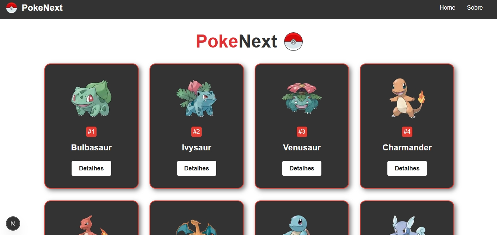

<h1 align="center">PokeNext</h1>

<div align="center">
  
</div>
<br/>

<p align="center">
   <b>Projeto pessoal simples de estudo para praticar o uso da tecnologia Next.js junto com consumo a API</b>
</p>

## 🚀 Sobre o Projeto

O **PokeAPI** é um projeto para fins de estudo visando o uso do Next.js e das vantagens do SSR (Server Side Rendering) e o consumo de uma API pública para a renderização e exibição dos conteúdos possibilitando a navegação pelas páginas.

- 📌 Tela inical com exibição de cards clicavéis de todos os pokemons numerados em ordem crescente.
- 📌 **Páginas dinâmicas** com informações de cada pokemon via API
- 📌 Navbar com links para **Home** e **Sobre**

## 🧪 Tecnologias Utilizadas

<div align="center">
  
  
  
  
</div>

## 💻 Telas Disponíveis
- **/** → Página principal com a exibição dos pokemons
- **/pokemon/id** → Página dinâmica com informações do pokemon selecionado
- **/about** → Página simples de sobre com informações fictícias

##

<p align="center">
  Abaixo, um indicador visual da página principal do projeto.
</p>



## 👇 É recomendável ter em sua máquina para rodar
- [Node](https://nodejs.org/pt) 21.0^

## 🌐 Rodando localmente

```bash
# Faça o git clone
$ git clone URL

# Instale as depedências
$ npm install

# Para executar em ambiente de desenvolvimento
$ npm run dev
# ou
yarn dev
# ou
pnpm dev
# ou
bun dev

# Abra http://localhost:3000 no seu navegador para ver o resultado.
```

## ⭕ Observações
> **Projeto não está totalmente responsivo**
